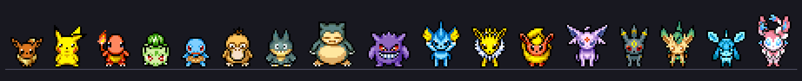

# Eevee: a Pokémon desktop buddy for Omarchy



A pixel Pokémon that lives along the bottom of your screen on [Omarchy](https://omarchy.org). Eevee by default, or Pikachu, Charmander, Bulbasaur, Squirtle, Psyduck, Munchlax, Snorlax or Gengar. She wanders around, naps when you're away, and:

- **Delivers your notifications** in her speech bubble instead of Omarchy's popups: 5 seconds each, a burst from one app folds into one bubble, and clicking one opens the app that sent it. While you're away, they wait and come back as one "while you were away" summary.
- **Evolves** (Eevee only) into the Eeveelution that fits the moment: Flareon when the CPU runs hot, Jolteon while charging, Umbreon at night, Espeon by day, Leafeon in the morning, Glaceon when it's cool, Vaporeon after a break, Sylveon after lots of pets. It wears off after 20 to 40 minutes.
- **Attacks** when an event matches her type: plug in the charger and Pikachu uses Thunderbolt. Fire types react to a hot CPU, Water to you coming back from a break, Grass to the morning, Ice to a cool machine, Ghost and Dark to a failed service, Fairy to pets, Psychic to answering you. Everyone attacks when a long command finishes.
- **Tells you when long commands finish**, if you've switched to another window: "✓ Done: mvn test · Took 2m 14s", or ✗ with the exit code. Clicking it jumps back to that terminal.
- **Answers questions** through the [Claude Code](https://claude.com/claude-code) CLI. It can look at your system with read-only tools, open apps, set reminders, remember things you tell it, look at your screen when you ask, and explain files you drop on her.
- **Naps on your lock screen**, via the optional [Lock Designs](https://github.com/SmoothPixels/lock-designs) plugin.
- **Plays music:** hover over her for the track with previous, play/pause and next. When nothing is playing, hovering shows CPU, memory, heat, battery and your next reminder.
- **Reduce motion** keeps her still and calm: no walking, attacks or flashes.
- **Stays out of the way:** she never talks unprompted, only notifications get a bubble, she hides while you share or record your screen, and a fullscreen window gets Omarchy's normal popups back.

Rare shiny days (1 in 4096) included.

## Install

```sh
omarchy plugin add https://github.com/Rafa2025/omarchy-eevee-buddy.git --enable
```

Optionally, a shortcut to talk to her from anywhere. Add this to `~/.config/hypr/bindings.lua`:

```lua
o.bind("SUPER + ALT + E", "Talk to Eevee", "omarchy-shell rafa.eevee talk")
```

### Requirements

Everything Omarchy ships, plus:

- `python3` and `jq`, used by the helper scripts
- the `claude` CLI, for chatting (optional: without it she just can't answer)
- `hyprpicker`, for the colour picker action (optional)
- the Lock Designs plugin, for the lock screen (optional)

## Using her

| | |
|---|---|
| Left click | Chat. Type a question, or `open spotify`, `launch github.com`, … |
| Right click | Quick actions: screenshot, copy text from screen, colour picker, clipboard, emoji, attack, focus, settings, lock |
| Middle click | Pet her |
| Hover | Music controls, or a status card |
| Drag | Move her |
| Drop a file | She reads it and explains it |

In the chat box: `/settings`, `/attack`, `/focus [minutes]` (holds notifications until the end), `/focus off`, `/remember <fact>`, `/forget [text]`, `/evolve [form]`, `/devolve`, `/reset`.

From scripts or keybindings:

```sh
omarchy-shell rafa.eevee talk            # open the chat box
omarchy-shell rafa.eevee settings
omarchy-shell rafa.eevee action lock     # any quick action by name
omarchy-shell rafa.eevee attack electric # or fire, water, grass, ice, psychic, dark, ghost, fairy, normal
omarchy-shell rafa.eevee focusMode 50
```

## Settings

Type `/settings` in her chat box, or run `omarchy-shell rafa.eevee settings`. The settings window covers which Pokémon, reduce motion, shiny, screen, size, wandering, music, evolution, attacks, notifications, the Claude model, memory, break reminders, long commands and the lock screen.

Settings are saved Omarchy's way, inline on the plugin's entry in `~/.config/omarchy/shell.json`.

## Privacy

- **Notifications:** she reads them from the session bus. While she's delivering them, Omarchy's Do Not Disturb is on, so its popups stay quiet and everything still goes to the notification history. Turning the setting off (or disabling the plugin) switches Do Not Disturb back off.
- **What reaches Claude:** only what you ask her, plus a small snapshot of the desktop (load, memory, open apps). Screenshots and files are sent only when you ask about your screen or drop a file on her.
- **Long commands:** the hook sees command lines only to name them in the notification; they never leave your machine.

## How it works

- `Buddy.qml` draws, animates and routes input. `EeveeSettings.qml` is the settings window.
- `bin/eevee-brain` does all the thinking and can be run from a terminal: system sensing (every 20 s), evolution, chat, launching apps, the lock screen, the command hook.
- `bin/eevee-notify.py` watches notifications, and `shell/eevee-hook.bash` times commands.
- Nothing polls: activity comes from Wayland idle notifications, and fullscreen, screen sharing, music and charging are all event-driven. The one periodic job, a 20 s system check, is plain bash builtins: it starts no other programs.
- The sprites are the PMD Sprite Repository's sprite sheets; `tools/fetch-sprites.py` downloads them and regenerates the credits.

## Credits and license

The code is MIT licensed. The sprites are CC BY-NC 4.0 artwork by the PMD Sprite Repository artists and Chunsoft: see [CREDITS.md](CREDITS.md).

Pokémon is © Nintendo, Creatures Inc. and GAME FREAK inc. This is an unofficial, non-commercial fan project.
